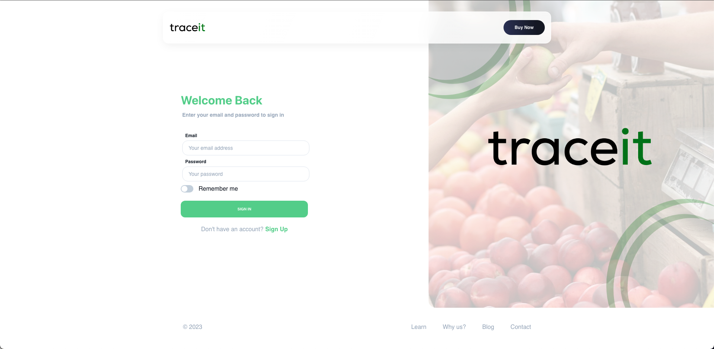
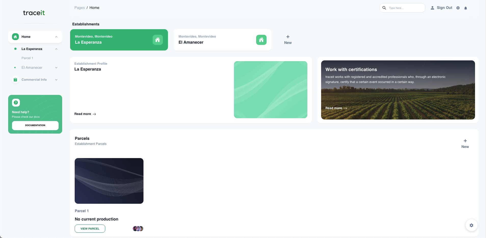
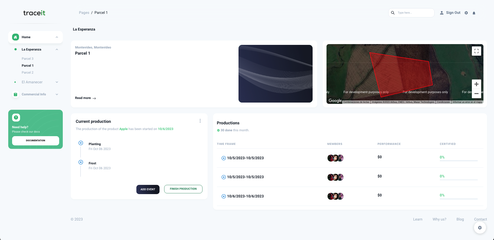
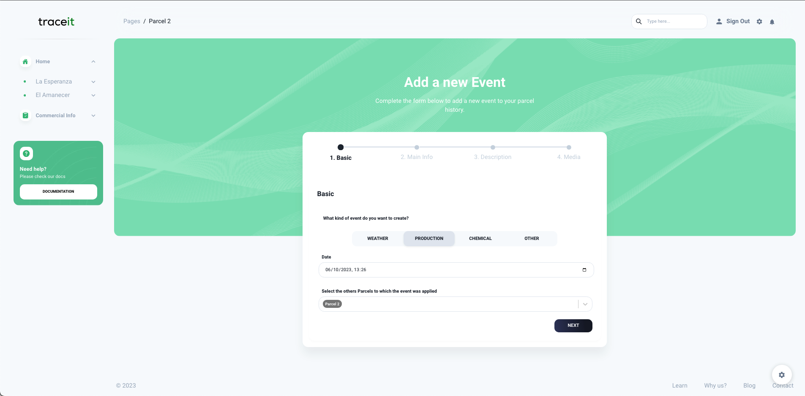
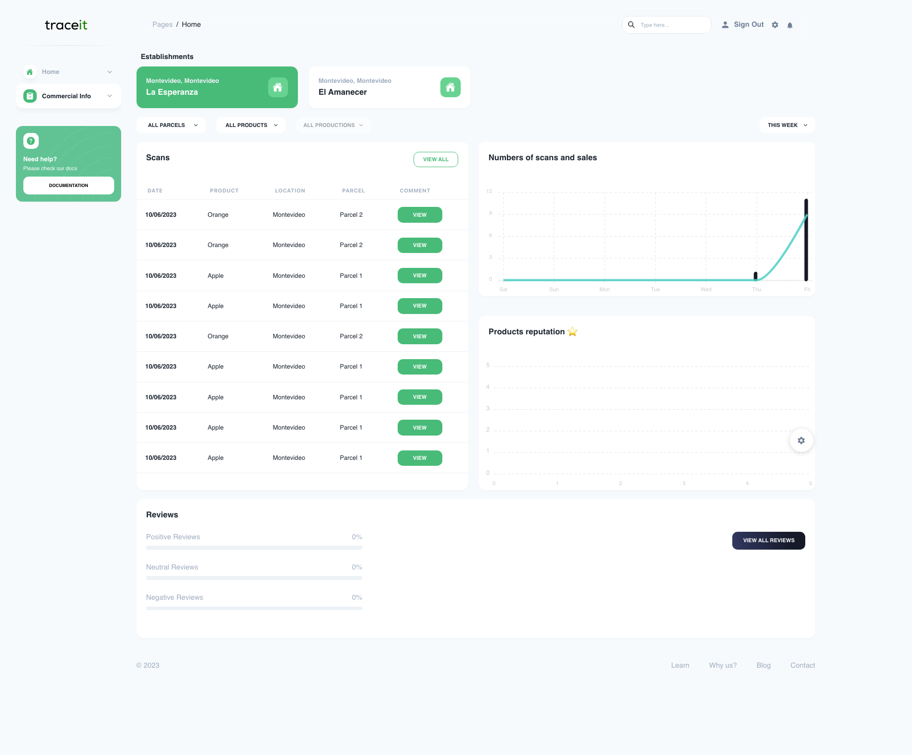

# trazo

Trazo is a COT (Customer-Oriented Traceability) system focused on the fruit and vegetable trade. Through a friendly interface, the producer declares and certifies the relevant events of his harvest, so that the final consumer can then read and evaluate them in the market.

This system aims to contribute to responsible eating, the diversification of activities of small producers, the consumer-producer approach and the creation of added value.

The main premise of COT systems is that for traceability systems to have a social impact, it is necessary for the end consumer to easily and quickly access the greatest amount of information about the product they are consuming.

## Demo link:

Access to the app at [trazo.io](https://app.trazo.io)

## Table of Content:

- [About The App](#about-the-app)
- [Screenshots](#screenshots)
- [Technologies](#technologies)
- [Setup](#setup)
- [Approach](#approach)
- [Status](#status)
- [Credits](#credits)
- [License](#license)

## About The App

In order to achieve the aim, I developed an app in React in which producers who belong to a company can create Establishments with Parcels inside, and then add to each one the different events that the productions are taking place. These events are the ones that the consumer will be able to see in the app.

## Screenshots

### Login page

### Establishment page

In this page the user can see the different parcels that belong to the establishment. The user can also add a new parcel or delete an existing one. By clicking on the parcel, the user will be redirected to the parcel page.

### Parcel page

In this page the user can see the different events that have been added to the parcel. The user can also see the current production. By clicking on the event, the user will be redirected to the event page.

### Add event page

In this page, the user can add a new event to the parcel. This is an example of a form in the app.

### Commercial page

In this page the user can see all the scans that have been done to the QR code of the production. By clicking on the scan, the user can see more information about that scan. The user also can see the reviews that the consumers have left about the production.

## Technologies

I React, Chakra UI for the UI, react-google-maps, React Router DOM, react-hook-form, Redux Toolkit, React JWT. For the components like Cards, Texts, Inputs, I used a template developed by [Creative-Tim](https://www.creative-tim.com). The app is deployed in Netlify. The backend is deployed in AWS. You can find the backend repository [here](https://github.com/oscarmunoz1/trazo-back).

<!-- ## Setup

- download or clone the repository
- run `npm install`
- ... -->

## Status

Trazo is still in progress. The next steps are:

## Credits

List of contriubutors:

- [Oscar Muñoz](https://www.linkedin.com/in/oscarmunoz256/)

## License

MIT license @ [author](author.com)
